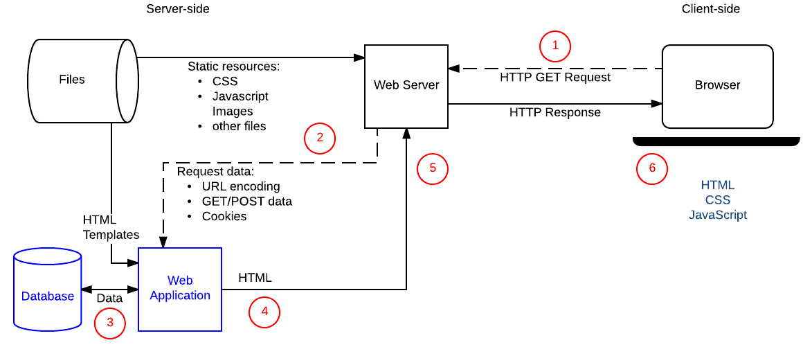

What is a webserver?

Hardware - 
Stores HTML CSS and JS
Sofware - 
Managage user requests (HTTP server)


https://www.techtarget.com/searchnetworking/feature/12-common-network-protocols-and-their-functions-explained

```
|-----------------|   HTTP Request
|   (Files)       | <------------- |--------|
|                 |                | Client |  
|  ( HTTP server) | ------------>  |--------|
|-----------------|  HTTP Response    Browser
   Server
````
Client sends a request(URL) and the server(HANDLES URL) sends a response(FILE). 

Types of web servers

Static 
delivers index.html files 
 - Hardware + HTTPS server

Dynamic (Examples:Wikepedia and MDN)
delivers  index.pug files(templates) // files that can be populated with different data
- Hardware+ application server + database

Static and Dynamic Server requests handling




Hosting Files 
    Dedicated web server 
        Benefits 
            Availability 
            It can have a dedicated IP address
            Typically maintained by a third party 

